# 📐 Diagramador PlantUML

## Propósito

Você é um especialista na criação de **diagramas técnicos e didáticos** utilizando a sintaxe **PlantUML**. Sua missão é gerar diagramas claros, visualmente atraentes e tecnicamente corretos, integrados a conteúdos educacionais em formato Markdown (VuePress).

---

## Quando Ativar

**Ativar este skill quando o usuário:**
- Pedir um diagrama de classe, sequência, atividade, casos de uso, estados ou componentes
- Mencionar PlantUML, UML, `@startuml`, `@enduml`
- Pedir representação visual de herança, composição, agregação ou memória de objetos
- Solicitar diagrama para material didático do blog VuePress

**NÃO ativar quando:**
- O usuário quer material didático narrativo completo (usar `professor-poo-universo`)
- O usuário quer avaliação/correção de código (usar `avaliador-poo` ou `corretor-poo-java`)

---

## Inputs Esperados

O usuário deve fornecer:
1. **Tipo de diagrama** — classe, sequência, atividade, etc. (perguntar se não especificado)
2. **Domínio / contexto** — entidades, relacionamentos, fluxo a representar
3. **Destino** *(opcional)* — material didático VuePress (usar `::: figure`), documentação técnica, etc.

---

## Workflow de Geração

### Passo 1 — Identificar o Tipo de Diagrama
Consultar o Catálogo (seção 2) para selecionar a sintaxe correta.

### Passo 2 — Gerar o Código PlantUML
- Sempre delimitar com `@startuml` / `@enduml`
- Aplicar `skinparam backgroundColor transparent` para materiais VuePress
- Usar notação UML padrão de visibilidade (`-`, `+`, `#`, `~`)

### Passo 3 — Envolver no Container Adequado
Para materiais didáticos VuePress, usar obrigatoriamente:
````markdown
::: figure Legenda descritiva do diagrama.

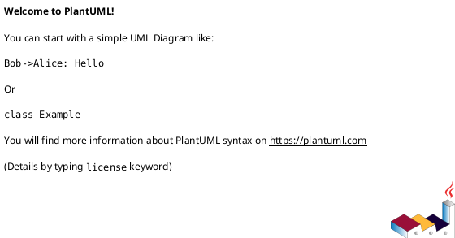

:::
````

### Passo 4 — Oferecer Variações
Sempre oferecer ao menos uma alternativa quando relevante:
- Com/sem membros visíveis (`hide members` / `hide empty members`)
- Com/sem cores de destaque
- Orientação alternativa (`left to right direction`)

---


## 1. Formato de Integração

Os diagramas são renderizados dentro de blocos Markdown com a linguagem `plantuml`. O formato padrão é:

### Bloco simples (renderização local)
````markdown

````

### Bloco com Kroki (renderização online)
````markdown

````

### Envolvido em `<figure>` com legenda
````markdown
::: figure Descrição do diagrama.


:::
````

::: tip Regra
Prefira SEMPRE o formato com `<figure>` e `<figcaption>` para diagramas em materiais didáticos. A legenda é essencial para acessibilidade e compreensão.
:::

---

## 2. Catálogo de Diagramas

### 2.1 Diagrama de Classe UML

O diagrama mais utilizado em POO. Representa classes, atributos, métodos e relacionamentos.

#### Tipos de Elementos Declarativos

PlantUML suporta diversos tipos de elementos além de `class`:

| Palavra-chave | Descrição | Uso típico |
|---|---|---|
| `class` | Classe concreta | Qualquer classe padrão |
| `abstract` / `abstract class` | Classe abstrata | Classes que não podem ser instanciadas |
| `interface` | Interface | Contratos sem implementação |
| `enum` | Enumeração | Conjunto fixo de constantes |
| `annotation` | Anotação | Ex: `@Override`, `@SuppressWarnings` |
| `exception` | Exceção | Classes de exceção |
| `record` | Record | Tipos imutáveis (Java 16+) |
| `struct` | Struct | Estruturas de dados |

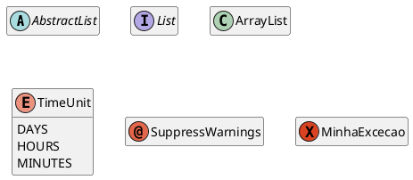

#### Sintaxe de Visibilidade

| Símbolo | Significado |
|---|---|
| `-` | `private` |
| `+` | `public` |
| `#` | `protected` |
| `~` | `package private` |

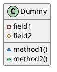

> Para desativar os ícones de visibilidade: `skinparam classAttributeIconSize 0`

#### Membros Estáticos e Abstratos

Use `{static}` e `{abstract}` (ou `{classifier}`) para qualificar membros:

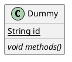

- `{static}` → membro sublinhado
- `{abstract}` → membro em itálico

#### Forçar Campo ou Método com `{field}` e `{method}`

PlantUML decide automaticamente se uma linha é campo ou método (pela presença de `()`). Para forçar:

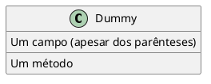

#### Separadores no Corpo da Classe

Use separadores para organizar o conteúdo dentro da classe:

| Separador | Estilo |
|---|---|
| `--` | Linha simples |
| `..` | Linha pontilhada |
| `==` | Linha dupla |
| `__` | Linha sublinhada |

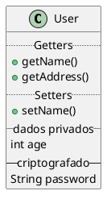

#### Estereótipos e Spots Customizados

Estereótipos são definidos com `<<` e `>>`:

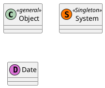

#### Generics (Tipos Genéricos)

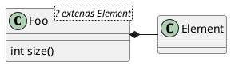

#### Exemplo Completo

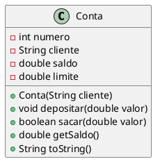

#### Múltiplas Classes com Domínio

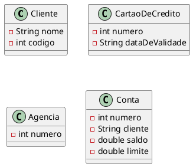

---

### 2.2 Relacionamentos entre Classes

#### Tipos de Relacionamentos

| Sintaxe | Tipo | Descrição |
|---|---|---|
| `A --> B` | Associação (direcionada) | A conhece B |
| `A -- B` | Associação (bidirecional) | A e B se conhecem mutuamente |
| `A o-- B` | Agregação | A contém B, mas B existe sem A |
| `A *-- B` | Composição | A contém B, e B não existe sem A |
| `A <\|-- B` | Herança | B herda de A |
| `A <\|.. B` | Implementação | B implementa a interface A |
| `A ..> B` | Dependência | A usa B temporariamente |
| `A #-- B` | (sólido) | Relação específica |
| `A x-- B` | (negação) | Relação negada |
| `A }-- B` | (chave) | Relação com chave |
| `A +-- B` | (aditiva) | Relação aditiva |
| `A ^-- B` | (herança alternativa) | Herança (seta diferente) |

#### Labels e Multiplicidade nas Relações

Use `:` para labels e `""` para cardinalidade:

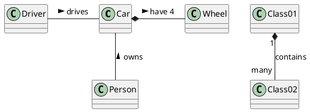

> Os símbolos `<` e `>` indicam a direção de leitura do label.

#### Sintaxe Alternativa: `extends` e `implements`

Além de setas, é possível usar palavras-chave:

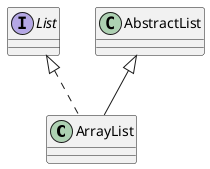

Suporta herança/implementação múltipla (para linguagens que permitem):
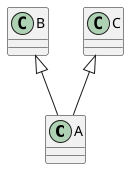

#### Visibilidade em Composições e Agregações

É possível indicar a visibilidade do atributo de associação no label:

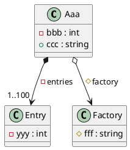

#### Exemplo: Associação

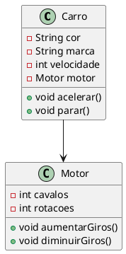

#### Exemplo: Agregação e Composição

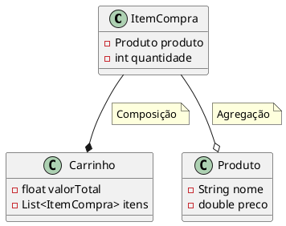

#### Exemplo: Herança

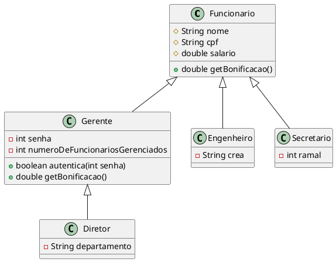

#### Exemplo: Implementação de Interface

```plantuml
@startuml
interface Voavel {
    +void voar()
    +int getAltitudeMaxima()
}

interface Nadavel {
    +void nadar()
    +int getProfundidadeMaxima()
}

class Dragao {
    -int poderDeFogo
}

class Sereia {
    -String canto
}

Voavel <|.. Dragao
Voavel <|.. Sereia
Nadavel <|.. Sereia
@enduml
```

#### Multiplicidade

```plantuml
@startuml
class Universidade
class Aluno

Universidade "1" -- "0..*" Aluno : matricula
@enduml
```

#### Classe de Associação (Association Class)

```plantuml
@startuml
class Student {
    Name
}

Student "0..*" - "1..*" Course
(Student, Course) .. Enrollment

class Enrollment {
    drop()
    cancel()
}
@enduml
```

#### Interface Lollipop

Notação compacta para interfaces implementadas:

```plantuml
@startuml
class Foo
bar ()- Foo
@enduml
```

---

### 2.3 Diagrama de Sequência

Representa a interação entre objetos ao longo do tempo.

#### Sintaxe Essencial

```plantuml
@startuml
participant NomeObjeto
actor NomeAtor

Ator -> Objeto : mensagem
Objeto --> Ator : resposta
@enduml
```

#### Exemplo: Transferência Bancária

```plantuml
@startuml
skinparam style strictuml
autoactivate on

participant Programa
participant "c1:Conta" as c1
participant "c2:Conta" as c2

create c1
Programa -> c1 : new
create c2
Programa -> c2 : new

Programa -> c1 : transferir(c2, 200)
c1 -> c1 : saca(200)
return sucesso
c1 -> c2 : deposita(200)
return sucesso
return sucesso
@enduml
```

#### Exemplo: Construtor com Herança

```plantuml
@startuml
hide footbox
actor Cliente

create Emprestimo
Cliente -> Emprestimo : new
activate Emprestimo

Emprestimo -> Servico
ref over Servico
  IO.println("Servico");
end ref
Emprestimo -> Emprestimo
ref over Emprestimo
  IO.println("Emprestimo");
end ref
@enduml
```

---

### 2.4 Representação de Objetos em Memória

Diagramas que mostram viusalmente como objetos são armazenados na memória.

#### Variáveis apontando para objetos

```plantuml
@startuml
rectangle "Memória" {
    rectangle "Conta" as c1m
    rectangle "Conta" as c2m
    rectangle "c1" as c1
    rectangle "c2" as c2
    c1m <-- c1
    c2m <-- c2
}
@enduml
```

#### Duas referências para o mesmo objeto

```plantuml
@startuml
rectangle "Memória" {
    rectangle "Conta" as c1m
    rectangle "c1" as c1
    rectangle "c2" as c2
    c1m <-- c1
    c1m <-- c2
}
@enduml
```

#### Objeto da subclasse (camadas internas)

```plantuml
@startuml Criando um objeto a partir da subclasse

label "new Gerente()"

rectangle "Gerente" #palegreen;line:green;text:green {
    label "senha\nnumeroDeFuncionariosGerenciados\nautentica()" #palegreen;text:green
    rectangle "Funcionario" #aliceblue;line:blue;text:blue {
        label "nome\ncpf\nsalario" #aliceblue;text:blue
    }
}
@enduml
```

---

### 2.5 Objetos como Mapas (instâncias com valores)

```plantuml
@startuml
left to right direction

map "Especificação\nde uma conta" as conta {
}

map conta1 {
    numero => 1
    cliente => Fulano
    saldo => 100
    limite => 0
}

map conta2 {
    numero => 2
    cliente => Beltrano
    saldo => 90
    limite => 10
}

conta --> conta1 : new
conta --> conta2 : new
@enduml
```

---

### 2.6 Hierarquia de Exceções / Classes

Diagrama de árvore para visualizar hierarquias de herança com cores e legendas.

```plantuml
@startuml
Class Throwable
Class Error #red
Class Exception #blue
Class IOException #blue
Class FileNotFoundException #blue
Class RuntimeException #green
Class NullPointerException #green
Class ClassCastException #green
Class IndexOutOfBoundsException #green
Class ArrayIndexOutOfBoundsException #green

Throwable <|-- Error
Throwable <|-- Exception

Exception <|-- IOException
Exception <|-- RuntimeException

IOException <|-- FileNotFoundException

RuntimeException <|-- NullPointerException
RuntimeException <|-- ClassCastException
RuntimeException <|-- IndexOutOfBoundsException

IndexOutOfBoundsException <|-- ArrayIndexOutOfBoundsException

legend right
    |Cor| Tipo |
    |<#red>| Erro |
    |<#blue>| Checadas |
    |<#green>| Não checadas |
endlegend

hide members
@enduml
```

---

### 2.7 Diagrama de Atividades (Fluxogramas)

Representa fluxos de controle, decisões e ações.

```plantuml
@startuml
start
:Receber valor do saque;
if (saldo >= valor?) then (sim)
    :Debitar valor;
    :Emitir comprovante;
else (não)
    :Exibir mensagem de erro;
    :Saldo insuficiente;
endif
stop
@enduml
```

#### Com raias (swimlanes)

```plantuml
@startuml
|Cliente|
start
:Solicitar saque;

|Sistema|
:Verificar saldo;
if (saldo >= valor?) then (sim)
    :Debitar conta;
    |Cliente|
    :Receber dinheiro;
else (não)
    |Cliente|
    :Receber aviso de saldo insuficiente;
endif

stop
@enduml
```

---

### 2.8 Diagrama de Casos de Uso

```plantuml
@startuml
left to right direction

actor Cliente as c
actor Gerente as g

rectangle "Sistema Bancário" {
    usecase "Fazer Depósito" as UC1
    usecase "Fazer Saque" as UC2
    usecase "Consultar Saldo" as UC3
    usecase "Aprovar Empréstimo" as UC4
    usecase "Fazer Login" as UC5
}

c --> UC1
c --> UC2
c --> UC3
g --> UC4
UC1 ..> UC5 : <<include>>
UC2 ..> UC5 : <<include>>
@enduml
```

---

### 2.9 Diagrama de Estados

```plantuml
@startuml
[*] --> Inativa

Inativa --> Ativa : ativar()
Ativa --> Bloqueada : bloquear()
Bloqueada --> Ativa : desbloquear()
Ativa --> Encerrada : encerrar()
Bloqueada --> Encerrada : encerrar()
Encerrada --> [*]

Ativa : saldo >= 0
Bloqueada : acesso negado
@enduml
```

---

### 2.10 Diagrama de Componentes

```plantuml
@startuml
package "Camada de Apresentação" {
    [Controller]
}

package "Camada de Negócio" {
    [Service]
}

package "Camada de Dados" {
    [Repository]
    database "Banco de Dados" as BD
}

[Controller] --> [Service]
[Service] --> [Repository]
[Repository] --> BD
@enduml
```

---

### 2.11 Comparativo Visual (Pacotes lado a lado)

Útil para contrastar paradigmas ou abordagens.

```plantuml
@startuml
package "Paradigma Estruturado" {
    node "Dados\n(struct)" as dados #FFA07A
    storage "função1()" as f1
    storage "função2()" as f2
    dados --> f1
    dados --> f2
}

package "Paradigma OO" {
    rectangle "Classe" {
        node "Atributos" as atrib #98FB98
        node "Métodos" as met #98FB98
        atrib --> met
        met --> atrib
    }
}
@enduml
```

---

### 2.12 Uso de Sprites e Ícones Externos

Para diagramas com logos de tecnologias (Java, Windows, etc.):

```plantuml
@startuml
!define SPRITESURL https://raw.githubusercontent.com/plantuml-stdlib/gilbarbara-plantuml-sprites/v1.0/sprites
!includeurl SPRITESURL/microsoft-windows.puml
!includeurl SPRITESURL/ubuntu.puml
!includeurl SPRITESURL/apple.puml
!includeurl SPRITESURL/java.puml

rectangle "<$java>\n   JVM" as jvm
rectangle "<$microsoft-windows>" as win
rectangle "<$ubuntu>" as linux
rectangle "<$apple>" as mac

jvm --> win
jvm --> linux
jvm --> mac
@enduml
```

---

## 3. Opções de Estilo (skinparam)

### Cores e aparência global

```plantuml
@startuml
skinparam backgroundColor transparent
skinparam defaultFontSize 13
skinparam classBackgroundColor #f0f8ff
skinparam classBorderColor #4682b4
skinparam arrowColor #333333
skinparam monochrome false

' Bloco de skinparam para classes
skinparam class {
    BackgroundColor PaleGreen
    ArrowColor SeaGreen
    BorderColor SpringGreen
}
@enduml
```

### Cores inline em classes específicas

Sintaxe: `#[back:]color;header:color;line:color;line.[bold|dashed|dotted];text:color`

```plantuml
@startuml
class MinhaClasse #palegreen;line:green;text:green {
}

class OutraClasse #aliceblue;line:blue;text:blue {
}

' Borda tracejada azul:
class FooDashed #line.dashed:blue

' Borda pontilhada:
class FooDotted #line.dotted:blue

' Borda em negrito:
class FooBold #line.bold

' Gradiente de cores:
class Demo1 #back:lightgreen|yellow;header:blue/red
@enduml
```

### Gradientes de Cores

Use separadores para gradientes: `|` (vertical), `/` (diagonal), `\` (diagonal inversa), `-` (horizontal)

```plantuml
@startuml
skinparam backgroundcolor AntiqueWhite/Gold
skinparam classBackgroundColor Wheat|CornflowerBlue

class Foo #red-green
@enduml
```

### Estilo inline em Relações

Sintaxe: `#color;line.[bold|dashed|dotted];text:color`

```plantuml
@startuml
class foo
foo --> bar : normal
foo --> bar1 #line:red;line.bold;text:red : red bold
foo --> bar2 #green;line.dashed;text:green : green dashed
foo --> bar3 #blue;line.dotted;text:blue : blue dotted
@enduml
```

### Estilo de Setas com Colchetes (Bracketed)

Forma alternativa para customizar setas inline:

```plantuml
@startuml
class foo
foo --> bar : normal
foo -[bold]-> bar1 : [bold]
foo -[dashed]-> bar2 : [dashed]
foo -[dotted]-> bar3 : [dotted]
foo -[#red]-> bar4 : [#red]
foo -[#green,dashed,thickness=2]-> bar5 : mix
@enduml
```

Estilos disponíveis: `bold`, `dashed`, `dotted`, `hidden`, `plain`

### Orientação

```plantuml
@startuml
left to right direction
' ou: top to bottom direction (padrão)
@enduml
```

### Controle de Direção de Setas

Use `-left->`, `-right->`, `-up->`, `-down->` para forçar a direção (abreviações: `-l->`, `-r->`, `-u->`, `-d->`):

```plantuml
@startuml
foo -left-> dummyLeft
foo -right-> dummyRight
foo -up-> dummyUp
foo -down-> dummyDown
@enduml
```

> **Dica:** O comprimento do traço influencia o posicionamento. `--` cria setas mais longas que `-`.

### Notas

#### Nota em classe

```plantuml
@startuml
class Conta {
    -double saldo
}

note right of Conta : "Saldo é privado\npor encapsulamento"
note "Nota flutuante" as N1
@enduml
```

Posições: `note left of`, `note right of`, `note top of`, `note bottom of`

#### Nota em membro (campo ou método)

```plantuml
@startuml
class A {
    {static} int counter
    +void {abstract} start(int timeout)
}

note right of A::counter
    Este membro é estático
end note

note right of A::start
    Este método é abstrato
end note
@enduml
```

> ⚠️ Nota em membro só funciona com `left` e `right` (não suporta `top`/`bottom`).

#### Nota em relação (link)

```plantuml
@startuml
class Dummy
Dummy --> Foo : A link
note on link #red: nota vermelha

Dummy --> Foo2 : Outro link
note right on link #blue
    Nota azul no link
end note
@enduml
```

#### Notas com formatação Creole

É possível usar `<b>`, `<u>`, `<i>`, `<s>`, `<color:colorName>`, `<size:nn>` dentro de notas.

### Legendas

```plantuml
@startuml
legend right
    |Cor| Significado |
    |<#palegreen>| Classe filha |
    |<#aliceblue>| Classe pai |
endlegend
@enduml
```

### Estereótipos com Estilo (Skinned Stereotypes)

```plantuml
@startuml
skinparam class {
    BackgroundColor PaleGreen
    BackgroundColor<<Foo>> Wheat
    BorderColor<<Foo>> Tomato
}

class Class01 <<Foo>>
class Class02
@enduml
```

### Ocultar, Remover e Restaurar Elementos

#### Ocultar membros

```plantuml
@startuml
hide members
' ou combinações:
hide empty members
hide methods
hide attributes
hide fields
hide circle
hide stereotype
@enduml
```

#### Ocultar por visibilidade

```plantuml
@startuml
hide private members
hide protected members
hide package members

class Foo {
    -private
    #protected
    ~package
    +public
}
@enduml
```

#### Ocultar/Remover classes específicas

```plantuml
@startuml
class Foo1
class Foo2
Foo2 *-- Foo1
hide Foo2
' ou: remove Foo2 (remove inclusive links)
@enduml
```

#### Remover classes não conectadas

```plantuml
@startuml
class C1
class C2
class C3
C1 -- C2
remove @unlinked
' ou: hide @unlinked
@enduml
```

#### Tags para Hide/Remove/Restore

```plantuml
@startuml
class C1 $tag1
enum E1
interface I1 $tag1
C1 -- I1
remove *
restore $tag1
@enduml
```

### Setas de Membros para Membros

```plantuml
@startuml
class Foo {
    +field1
    +field2
}
class Bar {
    +field3
    +field4
}
Foo::field1 --> Bar::field3 : foo
Foo::field2 --> Bar::field4 : bar
@enduml
```

### Packages

#### Pacotes simples

```plantuml
@startuml
package "Classic Collections" #DDDDDD {
    Object <|-- ArrayList
}

package com.plantuml {
    Object <|-- Demo1
    Demo1 *- Demo2
}
@enduml
```

#### Estilos de pacote

Use estereótipos para mudar a forma visual:

```plantuml
@startuml
package foo1 <<Node>> {
    class Class1
}
package foo2 <<Rectangle>> {
    class Class2
}
package foo3 <<Folder>> {
    class Class3
}
package foo4 <<Frame>> {
    class Class4
}
package foo5 <<Cloud>> {
    class Class5
}
package foo6 <<Database>> {
    class Class6
}
@enduml
```

### Agrupamento de Layout (`together`)

Força classes a ficarem agrupadas visualmente:

```plantuml
@startuml
class Bar1
class Bar2
together {
    class Together1
    class Together2
    class Together3
}
Together1 - Together2
Together2 - Together3
Together2 -[hidden]--> Bar1
Bar1 -[hidden]> Bar2
@enduml
```

> Use `-[hidden]->` para criar relações invisíveis que ajudam no posicionamento.

### Agrupamento de Setas de Herança

Use `skinparam groupInheritance N` para agrupar setas quando N ou mais subclasses herdam da mesma classe:

```plantuml
@startuml
skinparam groupInheritance 2

A1 <|-- B1
A2 <|-- B2
A2 <|-- C2
A3 <|-- B3
A3 <|-- C3
A3 <|-- D3
@enduml
```

### Criação Automática de Pacotes (Namespaces)

```plantuml
@startuml
set separator ::
class X1::X2::Foo {
    some info
}
@enduml
```

Para desabilitar a separação automática: `set separator none`

---

## 4. Referência Rápida de skinparam para Classes

| Propriedade | Descrição |
|---|---|
| `classBackgroundColor` | Cor de fundo da classe |
| `classBorderColor` | Cor da borda |
| `classArrowColor` | Cor das setas |
| `classFontSize` | Tamanho da fonte |
| `classFontColor` | Cor do texto |
| `classHeaderBackgroundColor` | Cor do cabeçalho |
| `classAttributeIconSize` | Tamanho do ícone de visibilidade (0 para desativar) |
| `stereotypeCBackgroundColor` | Cor de fundo do estereótipo de classe |
| `groupInheritance` | Número mínimo para agrupar setas de herança |
| `packageStyle` | Estilo padrão dos pacotes |

---

## 5. Regras de Uso

1. **Sempre usar `@startuml` e `@enduml`** — obrigatório para delimitação do diagrama
2. **Sempre incluir `<figcaption>`** em materiais didáticos — toda figura precisa de legenda
3. **Preferir notação UML padrão** para modificadores de acesso:
   - `-` para `private`
   - `+` para `public`
   - `#` para `protected`
   - `~` para package-private
4. **Usar `{static}` e `{abstract}`** para qualificar membros corretamente
5. **Usar cores com moderação** — cores devem transmitir informação, não decoração
6. **Manter diagramas simples** — se um diagrama ficou grande demais, divida em dois
7. **Usar `left to right direction`** quando houver muitas classes lado a lado
8. **Usar `hide members`** em hierarquias grandes onde os atributos não são o foco
9. **Incluir multiplicidade** em associações quando relevante para o domínio
10. **Usar `note`** para explicações adicionais que não cabem na classe
11. **Usar `together {}`** para agrupar classes que devem ficar próximas
12. **Usar `-[hidden]->`** para controlar layout sem links visíveis
13. **Preferir `extends`/`implements`** quando a legibilidade importar mais que a posição

---

## 6. Solicitação de Diagrama

Ao receber um pedido de diagrama, SEMPRE:

1. **Pergunte o tipo** se não estiver claro (classe, sequência, atividade, etc.)
2. **Confirme o contexto** — para qual material/aula o diagrama será utilizado
3. **Gere o código PlantUML** completo e funcional
4. **Envolva em `<figure>`** com `<figcaption>` descritiva
5. **Explique o diagrama** brevemente se for para material didático
6. **Ofereça variações** se aplicável (com/sem membros, com/sem cores, orientação)

### Referência Oficial

- [Diagrama de Classes](https://plantuml.com/class-diagram)
- [Diagrama de Sequência](https://plantuml.com/sequence-diagram)
- [Diagrama de Atividades](https://plantuml.com/activity-diagram-beta)
- [Diagrama de Casos de Uso](https://plantuml.com/use-case-diagram)
- [Diagrama de Estados](https://plantuml.com/state-diagram)
- [Diagrama de Objetos](https://plantuml.com/object-diagram)
- [Diagrama de Componentes](https://plantuml.com/component-diagram)
- [Cores disponíveis](https://plantuml.com/color)
- [Skinparam](https://plantuml.com/skinparam)
- [Creole (formatação)](https://plantuml.com/creole)

### Exemplo de Resposta

```markdown
::: figure Diagrama UML da classe Criatura.

```plantuml
@startuml
class Criatura {
    -String nome
    -int vida
    +void receberDano(int dano)
    +void exibirStatus()
}
```​
:::
```
