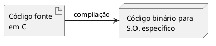

## Exemplos de Uso de tabelas e diagramas

### Tabelas

|         | Homem        | Cão              | Mosca           |
| ------- | ------------ | ---------------- | --------------- |
| Reino   | Animalia     | Animalia         | Animalia        |
| Filo    | Chordata     | Chordata         | Arthropoda      |
| Classe  | Mammalia     | Mammalia         | Insecta         |
| Ordem   | Primata      | Carnívora        | Díptera         |
| Família | Hominidae    | Canidae          | Muscidae        |
| Gênero  | Homo         | Canis            | Musca           |
| Espécie | Homo sapiens | Canis familiaris | Musca domestica |

:Tabela de taxonomia de Linnaeus para classificação de Homem, Cão e Mosca

### Figuras

#### modo 1
<figure>

<figcaption> Representação do processo de compilação.</figcaption>
</figure>

#### modo 2

::: figure Representação do processo de compilação.

:::

#### Heading 3

Here is the content.
