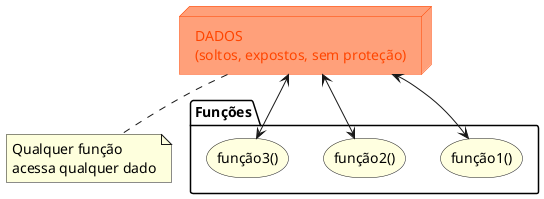
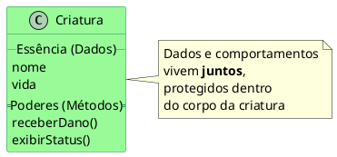
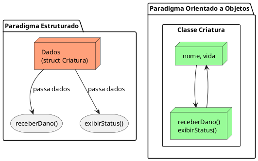

::: tip

**Antes de criar o universo, o Deus precisa decidir como vai criá-lo.**

:::

## 📖 A Revelação

### O que é um paradigma?

A palavra **paradigma** vem do grego _parádeigma_ e significa **modelo**, **padrão**, **exemplo a ser seguido**. No dicionário Aurélio:

::: note Paradigma
Algo que serve de exemplo geral ou de modelo.
:::

Na programação, um **paradigma** é a forma como você organiza o pensamento para resolver problemas com código. É como se fosse a **filosofia** por trás da linguagem. Duas linguagens podem resolver o mesmo problema de formas completamente diferentes — tudo depende do paradigma que seguem.

Pense assim: antes de construir uma casa, você precisa decidir **como** vai construir. Com tijolos? Com madeira? Com impressão 3D? Cada abordagem tem suas regras, vantagens e limitações. O mesmo acontece com código.

### Os principais paradigmas

| Paradigma                    | Ideia Central                                             | Exemplo de Linguagem |
| ---------------------------- | --------------------------------------------------------- | -------------------- |
| **Imperativo / Estruturado** | Sequência de instruções que mudam o estado do programa    | C, Pascal            |
| **Orientado a Objetos**      | Organização em objetos que possuem dados e comportamentos | Java, C#, Python     |
| **Funcional**                | Avaliação de funções matemáticas puras                    | Haskell, Elixir      |
| **Lógico**                   | Regras e inferências lógicas                              | Prolog               |
| **Declarativo**              | Descreve _o que_ fazer, não _como_                        | SQL, HTML            |

:Exemplos de Paradigmas e Linguagens

::: tip Multiparadigma
Muitas linguagens modernas são **multiparadigma**: Java, Python, C#, JavaScript. Elas permitem usar mais de um estilo. Mas cada uma tem um paradigma **dominante** — e o de Java é a **Orientação a Objetos**.
:::

Nesta disciplina, nosso foco será o **orientado a objetos**. Entender a diferença entre ele e o estruturado é o primeiro passo para se tornar um **Deus Criador** de universos digitais.

## A Gênese

### O Caos Primordial: A Programação Estruturada


Imagine que, antes de existirem universos, havia apenas o **Caos**. Um vazio onde todas as coisas existiam soltas, desorganizadas, sem forma.

Na programação estruturada, é mais ou menos assim: você tem **dados** de um lado e **funções** de outro. Os dados ficam expostos, vulneráveis, e qualquer função pode mexer neles. Não existe dono. Não existe proteção. Não existe identidade.

<figure>



<figcaption>Paradigma Estruturado: dados e funções separados.</figcaption>
</figure>

É como um universo onde os átomos flutuam sem lei, sem gravidade, sem ordem. Funciona? Até funciona — para universos pequenos. Mas quando o universo cresce... o caos vence.

::: warning
Na programação estruturada, os dados são como órgãos espalhados pelo chão. Qualquer um pode mexer no coração, no fígado, no cérebro. Não existe corpo. Não existe criatura. Só peças soltas.
:::

### A Ordem Divina: A Programação Orientada a Objetos

Agora imagine que um **Deus Criador** resolve colocar ordem no caos. Ele decide:

1. Cada criatura terá **seu próprio corpo** (dados e comportamentos juntos)
2. Cada criatura será **única** (cada objeto é independente)
3. Ninguém poderá mexer nas entranhas de uma criatura sem permissão (**encapsulamento**)
4. As criaturas poderão ter **linhagens** (herança)
5. Criaturas poderão assinar **pactos** para ganhar poderes (interfaces)

::: figure Paradigma OO: dados e comportamentos juntos dentro da classe.



:::

Na orientação a objetos, dados e comportamentos vivem **juntos**, dentro de uma mesma estrutura chamada **classe**. Cada exemplar gerado a partir dessa classe é um **objeto** — uma criatura viva no universo digital.

::: warning
A Orientação a Objetos não é apenas uma forma de programar. É uma forma de pensar. Você deixa de dar ordens a um computador e passa a criar seres que interagem entre si.
:::

## 💻 O Código Sagrado

Vamos ver a diferença na prática. Imagine um sistema simples: **gerenciar criaturas com nome e vida**.

### 🔴 No Paradigma Estruturado (em C)

Dados e funções existem **separados**. Qualquer função pode acessar e modificar qualquer dado diretamente.

```c
#include <stdio.h>
#include <string.h>

// Dados — soltos, expostos
struct Criatura {
    char nome[50];
    int vida;
};

// Funções — separadas dos dados
void receberDano(struct Criatura *c, int dano) {
    c->vida -= dano;
    if (c->vida < 0) c->vida = 0;
}

void exibirStatus(struct Criatura *c) {
    printf("Nome: %s | Vida: %d\n", c->nome, c->vida);
}

int main() {
    struct Criatura fenix;
    strcpy(fenix.nome, "Fenix");
    fenix.vida = 100;

    exibirStatus(&fenix);
    receberDano(&fenix, 30);
    exibirStatus(&fenix);

    // ⚠️ Qualquer um pode fazer isso:
    fenix.vida = 999999; // Ninguém impediu!
    exibirStatus(&fenix);

    return 0;
}
```

**O que há de errado?**

- Os dados da criatura estão **expostos**. Qualquer parte do código pode alterar `vida` diretamente.
- As funções `receberDano` e `exibirStatus` não **pertencem** à criatura. Elas existem soltas no universo.
- Se criarmos outros tipos de criaturas (Dragão, Guerreiro), teremos que criar **novas funções** para cada tipo ou encher as funções de `if-else`.
- À medida que o sistema cresce, o código vira um **emaranhado** de funções e `structs` sem relação clara.

### 🟢 No Paradigma Orientado a Objetos (em Java)

Dados e comportamentos vivem **juntos** dentro do objeto.

```java
// O Molde — a Forma da Criação
public class Criatura {
    // A Essência (atributos) — protegida dentro do corpo
    String nome;
    int vida;

    // Os Poderes (métodos) — pertencem à criatura
    void receberDano(int dano) {
        this.vida -= dano;
        if (this.vida < 0) this.vida = 0;
    }

    void exibirStatus() {
        IO.println("Nome: " + this.nome + " | Vida: " + this.vida);
    }
}
```

```java
// O Deus Criador escreve as leis do universo
public class Universo {
    public static void main(String[] args) {
        // O Gesto da Criação — uma criatura nasce!
        Criatura fenix = new Criatura();
        fenix.nome = "Fenix";
        fenix.vida = 100;

        fenix.exibirStatus();  // A criatura responde!
        fenix.receberDano(30); // A criatura sabe se proteger
        fenix.exibirStatus();

        // Criando outra criatura do mesmo molde
        Criatura smaug = new Criatura();
        smaug.nome = "Smaug";
        smaug.vida = 200;

        smaug.exibirStatus();
    }
}
```

**O que mudou?**

- `nome` e `vida` estão **dentro** da classe `Criatura` — eles pertencem a ela.
- `receberDano()` e `exibirStatus()` também estão **dentro** da classe — a criatura sabe o que fazer consigo mesma.
- Cada criatura (`fenix`, `smaug`) é um **objeto independente**, com sua própria essência.
- O código do `main` não precisa saber _como_ a criatura recebe dano — só precisa pedir. Isso é o início do **encapsulamento**.

### O Comparativo Visual

<figure>



<figcaption> Estruturado: dados e funções separados. OO: dados e comportamentos juntos.</figcaption>
</figure>

### ⚡ Resumo das Diferenças

| Aspecto            | Estruturado                          | Orientado a Objetos                 |
| ------------------ | ------------------------------------ | ----------------------------------- |
| **Organização**    | Dados + funções separados            | Dados + métodos juntos (classe)     |
| **Unidade básica** | Função / procedimento                | Objeto                              |
| **Dados**          | Expostos (qualquer um acessa)        | Protegidos (encapsulamento)         |
| **Reutilização**   | Copiar e colar funções               | Herança e composição                |
| **Complexidade**   | Funciona bem para problemas pequenos | Escala para sistemas grandes        |
| **Metáfora**       | Órgãos soltos no chão                | Criaturas vivas com corpo e poderes |

::: tip Importante
A Programação Estruturada **não é ruim** — ela é excelente para scripts curtos, automações simples e problemas pequenos. Mas quando o sistema cresce, a Orientação a Objetos oferece ferramentas poderosas para organizar, proteger e reutilizar código.
:::

<!--
## 🔨 O Desafio do Criador

 - [Desafio 01 - Paradigmas de Programação](../desafios/01_paradigmas.md)

-->
