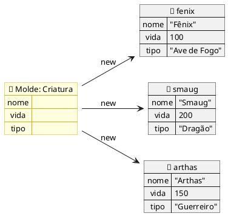
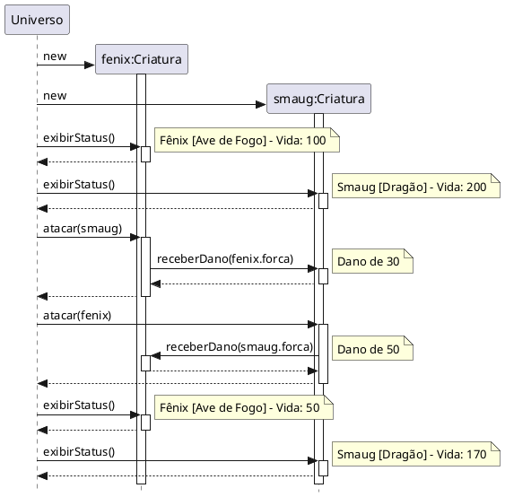
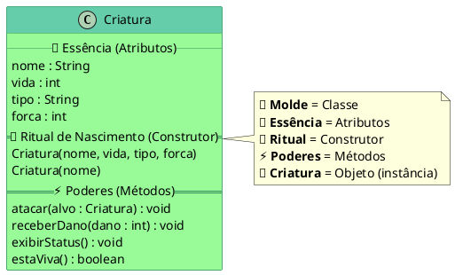

::: tip

**No primeiro dia, o Deus decidiu que o Caos não bastava. Era hora de criar Moldes — e dar vida às Criaturas.**

:::

## 📖 A Revelação

### O que é uma Classe?

Na aula anterior, você entendeu que na Programação Orientada a Objetos os dados e comportamentos vivem **juntos**. Agora é hora de entender **onde** eles vivem juntos: dentro de uma `Classe`.

::: note Classe
Uma classe é a **descrição** de um conjunto de entidades que compartilham os mesmos **atributos** (características), **métodos** (comportamentos) e **semântica** (significado). É o **molde** a partir do qual objetos são criados.
:::

A palavra _classe_ vem da taxonomia da biologia. Todos os seres vivos de uma mesma classe biológica têm uma série de atributos e comportamentos em comum — mas não são iguais. Podem variar nos **valores** desses atributos e na forma como realizam esses comportamentos.

Pense na espécie _Homo Sapiens_. Ela define um grupo de seres com características em comum: possuem nome, idade, altura. Mas _Homo Sapiens_ é um ser humano? **Não.** _Homo Sapiens_ é a **especificação**. Para ter um ser humano de verdade, você precisa de uma **instância** — um objeto concreto criado a partir dessa especificação.

::: tip Analogias

- Uma **receita de bolo** não é um bolo. Você precisa instanciá-la para comer.
- A **planta de uma casa** não é uma casa. Você mora no objeto, não no molde.
- O **molde de uma criatura** não é uma criatura. Você precisa dar vida a ela.

:::

### O que é um Objeto?

Um **objeto** é uma instância de uma classe — uma entidade concreta, única e independente que existe no universo do programa. Cada objeto:

- É **único** — mesmo que dois objetos venham do mesmo molde, são entidades diferentes
- Possui **atributos** que definem suas características e seu estado atual
- Possui **métodos** que definem o que ele pode fazer
- É **independente** — armazena seus próprios dados e executa suas próprias ações

::: tip Exemplo
Objeto do tipo **Conta**

- **Estrutura (Atributos):** titular, número, saldo, limite
- **Comportamento (Métodos):** sacar, depositar, transferir

:::

### Atributos

Os **atributos** são as propriedades de uma classe. Eles descrevem as características que cada objeto terá. Após a classe ser instanciada em um objeto, os atributos recebem **valores** concretos que definem aquele objeto específico.

```java
class Conta {
    int numero;       // atributo
    String cliente;   // atributo
    double saldo;     // atributo
    double limite;    // atributo
}
```

Cada conta criada a partir desse molde terá seu **próprio** número, seu **próprio** cliente, seu **próprio** saldo. O molde é um só — as criaturas são muitas.

### Métodos

Os **métodos** definem o que um objeto pode **fazer**. São as ações, os comportamentos, as habilidades da criatura.

- São acionados por **outros objetos** (ou pelo próprio programa)
- É assim que os objetos se **comunicam** — através de chamadas de métodos (troca de mensagens)

Um método pode:

- **Não retornar nada** (`void`) — executa uma ação sem devolver informação
- **Retornar um valor** — executa uma ação e devolve uma resposta

### Construtor

O **construtor** é um método especial que é executado **automaticamente** no momento em que um objeto é criado. Ele serve para:

- **Inicializar** os atributos do objeto com valores válidos
- **Garantir** que toda criatura nasça com uma essência definida
- **Evitar** que objetos existam em estados inválidos ou vazios

Regras do construtor:

1. Tem o **mesmo nome** da classe
2. **Não** tem tipo de retorno (nem `void`)
3. É chamado automaticamente pelo operador `new`
4. Se você não criar nenhum, Java fornece um **construtor padrão** (sem parâmetros)
5. Uma classe pode ter **vários construtores** com parâmetros diferentes

## 🌌 A Gênese

### No Primeiro Dia, o Deus Criou os Moldes

Na aula anterior, o Deus Criador separou a Ordem do Caos. Ele entendeu que dados e comportamentos devem viver **juntos**, protegidos, dentro de uma mesma estrutura. Agora é hora de dar o próximo passo: criar os **Moldes**.


Um **Molde** (📐 Classe) é o projeto divino — a planta baixa de cada tipo de criatura que existirá no universo. Nele, o Deus define:

- A **Essência** (🧬 Atributos) — o que a criatura **é**: seu nome, sua vida, seu tipo
- Os **Poderes** (⚡ Métodos) — o que a criatura **pode fazer**: atacar, se curar, exibir seu status
- O **Ritual de Nascimento** (🌅 Construtor) — o momento exato em que a criatura ganha vida, com sua essência já definida

::: warning
O Molde não é a criatura. Ele é a **ideia** da criatura. Para que uma criatura de verdade exista no universo, o Deus deve realizar o **Gesto da Criação**: invocar `new` e dar vida ao molde.
:::

Cada criatura (🐾 Objeto) que nasce a partir de um molde é **única**. Duas criaturas podem vir do mesmo projeto, mas cada uma tem sua própria essência — seu próprio nome, sua própria vida.

::: figure Um Molde (classe), três Criaturas (objetos) — cada uma com sua própria essência.



:::

::: tip
O Molde é a ideia. A Criatura é a realidade. Sem o `new`, você tem um sonho. Com o `new`, você tem um ser vivo.
:::

Mas um Deus sábio não cria criaturas sem regras. Ele define um **Ritual de Nascimento** (🌅 Construtor) — um procedimento que garante que toda criatura nasça com sua essência já definida. Sem esse ritual, as criaturas nasceriam vazias, sem nome, sem vida — fantasmas no universo digital.

> _"Uma classe sem construtor é como um universo sem Big Bang. Até existe… mas nada acontece."_

## 💻 O Código Sagrado

### Fase 1 — O Primeiro Molde (Classe com Atributos)

O Deus Criador começa simples. Ele projeta o primeiro molde — uma Criatura com essência básica:

```java
// 📐 O Molde da Criação — a Forma de toda Criatura
public class Criatura {
    // 🧬 A Essência — o que define cada criatura
    String nome;
    int vida;
    String tipo;
}
```

Três linhas. Três atributos. Três peças de essência que toda criatura carregará. Mas o molde sozinho não faz nada. É hora de criar uma criatura de verdade.

### Fase 2 — O Gesto da Criação (Instanciando Objetos)


```java
public class Universo {
    public static void main(String[] args) {
        // 🌅 O Gesto da Criação — uma criatura nasce!
        Criatura fenix = new Criatura();
        fenix.nome = "Fênix";
        fenix.vida = 100;
        fenix.tipo = "Ave de Fogo";

        // Outra criatura do mesmo molde — mas única!
        Criatura smaug = new Criatura();
        smaug.nome = "Smaug";
        smaug.vida = 200;
        smaug.tipo = "Dragão";

        IO.println(fenix.nome + " tem " + fenix.vida + " de vida.");
        IO.println(smaug.nome + " tem " + smaug.vida + " de vida.");
    }
}
```

Observe: `fenix` e `smaug` vêm do **mesmo molde**, mas são criaturas **diferentes**. Cada uma tem sua própria essência.

### Fase 3 — Os Poderes Concedidos (Métodos)

Um molde sem poderes cria criaturas inertes. O Deus agora concede habilidades:

#### Métodos sem retorno (`void`)

```java
public class Criatura {
    String nome;
    int vida;
    String tipo;

    // ⚡ Poder: receber dano
    void receberDano(int dano) {
        vida -= dano;
        if (vida < 0) vida = 0;
    }

    // ⚡ Poder: exibir seu status
    void exibirStatus() {
        IO.println(nome + " [" + tipo + "] - Vida: " + vida);
    }

    // ⚡ Poder: curar-se
    void curar(int cura) {
        vida += cura;
    }
}
```

Agora a criatura **sabe** o que fazer. Ela sabe receber dano, sabe se curar, sabe exibir seu status. O Deus não precisa mais manipular as entranhas diretamente — ele dá uma ordem, e a criatura age.

```java
public class Universo {
    public static void main(String[] args) {
        Criatura fenix = new Criatura();
        fenix.nome = "Fênix";
        fenix.vida = 100;
        fenix.tipo = "Ave de Fogo";

        fenix.exibirStatus();      // Fênix [Ave de Fogo] - Vida: 100
        fenix.receberDano(30);     // A criatura sabe se proteger
        fenix.exibirStatus();      // Fênix [Ave de Fogo] - Vida: 70
        fenix.curar(10);           // A criatura sabe se curar
        fenix.exibirStatus();      // Fênix [Ave de Fogo] - Vida: 80
    }
}
```

#### Métodos com retorno

Às vezes, o Deus quer que a criatura **responda** quando é acionada. Para isso, o método deve **retornar** um valor:

```java
public class Criatura {
    String nome;
    int vida;
    String tipo;

    // ⚡ Poder com resposta: sacar vida com validação
    boolean receberDano(int dano) {
        if (dano > vida) {
            return false; // Dano excessivo — recusado
        }
        vida -= dano;
        return true; // Dano aplicado com sucesso
    }

    // ⚡ Poder com resposta: verificar se está viva
    boolean estaViva() {
        return vida > 0;
    }

    void exibirStatus() {
        IO.println(nome + " [" + tipo + "] - Vida: " + vida);
    }
}
```

```java
public class Universo {
    public static void main(String[] args) {
        Criatura fenix = new Criatura();
        fenix.nome = "Fênix";
        fenix.vida = 100;
        fenix.tipo = "Ave de Fogo";

        boolean sobreviveu = fenix.receberDano(30);
        if (sobreviveu) {
            IO.println("A criatura resistiu ao golpe!");
        } else {
            IO.println("O golpe foi demais para a criatura!");
        }

        IO.println("Está viva? " + fenix.estaViva());
    }
}
```

#### Métodos que recebem objetos

Criaturas podem interagir **entre si**. O verdadeiro poder surge quando um objeto comunica-se com outro:

```java
public class Criatura {
    String nome;
    int vida;
    String tipo;
    int forca;

    void atacar(Criatura alvo) {
        IO.println(nome + " ataca " + alvo.nome + "!");
        alvo.receberDano(forca);
    }

    void receberDano(int dano) {
        vida -= dano;
        if (vida < 0) vida = 0;
    }

    void exibirStatus() {
        IO.println(nome + " [" + tipo + "] - Vida: " + vida);
    }
}
```

<figure>



<figcaption>Diagrama de sequência: Fênix ataca fenix — objetos se comunicando.</figcaption>
</figure>

```java
public class Universo {
    public static void main(String[] args) {
        Criatura fenix = new Criatura();
        fenix.nome = "Fênix";
        fenix.vida = 100;
        fenix.tipo = "Ave de Fogo";
        fenix.forca = 30;

        Criatura smaug = new Criatura();
        smaug.nome = "Smaug";
        smaug.vida = 200;
        smaug.tipo = "Dragão";
        smaug.forca = 50;

        fenix.exibirStatus();
        smaug.exibirStatus();

        fenix.atacar(smaug); // Fênix ataca Smaug!
        smaug.atacar(fenix); // Smaug contra-ataca!

        fenix.exibirStatus();
        smaug.exibirStatus();
    }
}
```

### Fase 4 — O Ritual de Nascimento (Construtor)

Até agora, nossas criaturas nascem **vazias** e precisamos preencher seus atributos um a um. Isso é perigoso — e se o Deus esquecer de definir o nome? A criatura existirá sem identidade!

O **Construtor** resolve isso. Ele é o Ritual de Nascimento — garante que toda criatura nasça com sua essência já definida:

```java
public class Criatura {
    String nome;
    int vida;
    String tipo;
    int forca;

    // 🌅 O Ritual de Nascimento — toda criatura nasce completa
    Criatura(String nome, int vida, String tipo, int forca) {
        this.nome = nome;
        this.vida = vida;
        this.tipo = tipo;
        this.forca = forca;
    }

    void atacar(Criatura alvo) {
        IO.println(this.nome + " ataca " + alvo.nome + "!");
        alvo.receberDano(this.forca);
    }

    void receberDano(int dano) {
        this.vida -= dano;
        if (this.vida < 0) this.vida = 0;
    }

    void exibirStatus() {
        IO.println(this.nome + " [" + this.tipo + "] - Vida: " + this.vida);
    }

    boolean estaViva() {
        return this.vida > 0;
    }
}
```

Agora, o Gesto da Criação é **mais poderoso e seguro**:

```java
public class Universo {
    public static void main(String[] args) {
        // 🌅 Criaturas nascem completas — o Ritual garante!
        Criatura fenix = new Criatura("Fênix", 100, "Ave de Fogo", 30);
        Criatura smaug = new Criatura("Smaug", 200, "Dragão", 50);
        Criatura arthas = new Criatura("Arthas", 150, "Guerreiro", 40);

        fenix.exibirStatus();
        smaug.exibirStatus();
        arthas.exibirStatus();

        IO.println("--- A Batalha Começa ---");
        fenix.atacar(smaug);
        smaug.atacar(arthas);
        arthas.atacar(fenix);

        fenix.exibirStatus();
        smaug.exibirStatus();
        arthas.exibirStatus();
    }
}
```

#### A palavra-chave `this`

Dentro de um método ou construtor, `this` se refere ao **próprio objeto** — à criatura que está executando a ação. Quando escrevemos `this.nome = nome`, estamos dizendo: "o atributo `nome` **desta criatura** recebe o valor do parâmetro `nome`".

#### Múltiplos Construtores

Uma classe pode ter vários Rituais de Nascimento — cada um para uma situação diferente:

```java
public class Criatura {
    String nome;
    int vida;
    String tipo;
    int forca;

    // Ritual completo
    Criatura(String nome, int vida, String tipo, int forca) {
        this.nome = nome;
        this.vida = vida;
        this.tipo = tipo;
        this.forca = forca;
    }

    // Ritual simplificado — criatura nasce com valores padrão
    Criatura(String nome) {
        this.nome = nome;
        this.vida = 100;   // vida padrão
        this.tipo = "Desconhecido";
        this.forca = 10;   // força padrão
    }

    // ... métodos ...
}
```

```java
// Duas formas de criar:
Criatura fenix = new Criatura("Fênix", 100, "Ave de Fogo", 30);  // Ritual completo
Criatura misterio = new Criatura("???");  // Ritual simplificado
```

### Resumo visual: anatomia de uma Classe

::: figure Anatomia completa de uma Classe: atributos, construtores e métodos.



:::

<!--
## 🔨 O Desafio do Criador

 - [Desafio 02 - Classes, Atributos, Métodos e Construtores](../desafios/02_classes.md)

-->
