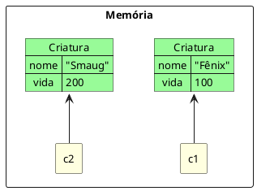
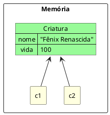
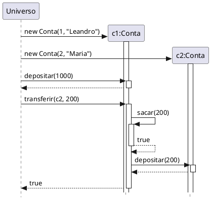
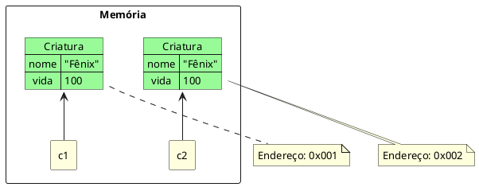

::: tip

**As criaturas já existem. Agora é hora de entender como elas vivem, se comunicam e se reconhecem no universo.**

:::

## 📖 A Revelação

### Referência: onde a criatura realmente mora?

Na aula anterior, você aprendeu a criar classes com atributos, métodos e construtores. Mas quando escrevemos algo como:

```java
Criatura fenix = new Criatura("Fênix", 100, "Ave de Fogo", 30);
```

O que **exatamente** está guardado na variável `fenix`? A criatura inteira? **Não.**

::: note Referência
Uma variável de tipo objeto **não** armazena o objeto em si. Ela armazena uma **referência** — o endereço de memória onde o objeto foi criado. É como uma placa com o endereço da casa, não a casa em si.
:::

Isso tem consequências profundas:

- **Atribuir** uma variável a outra (`c2 = c1`) **não** copia o objeto — apenas copia o endereço. Ambas passam a apontar para o **mesmo** objeto.
- **Comparar** duas variáveis com `==` compara os **endereços**, não o conteúdo dos objetos.
- **Passar** um objeto como parâmetro de método envia a **referência** — o método pode alterar o objeto original.

### Comunicação entre objetos

Os objetos não existem isolados. Eles interagem entre si através de **mensagens** — que, em Java, são chamadas de **métodos**.

Quando um objeto chama um método de outro, ele está enviando uma mensagem:

- O **remetente** é quem chama o método
- O **destinatário** é quem executa
- A **mensagem** é o nome do método + seus parâmetros
- A **resposta** é o valor de retorno (se houver)

É assim que o universo funciona: criaturas se comunicam, colaboram e interagem. Um objeto **nunca** faz tudo sozinho — o poder está na interação.

### Comparação: `==` vs `equals`

Em Java, existem duas formas de comparar objetos — e entender a diferença é **essencial**:

| Operador / Método | O que compara                      | Quando usar                         |
| ----------------- | ---------------------------------- | ----------------------------------- |
| `==`              | Os **endereços** (referências)     | Verificar se são o **mesmo** objeto |
| `equals()`        | O **conteúdo** (como você definir) | Verificar se são **equivalentes**   |

Por padrão, o método `equals()` herdado de `Object` compara endereços (igual ao `==`). Para comparar pelo conteúdo, você precisa **sobrescrever** o método na sua classe.

### toString: a identidade da criatura

Quando você tenta imprimir um objeto com `IO.println(fenix)`, o Java automaticamente chama o método `toString()` desse objeto. Por padrão, ele retorna algo como `Criatura@1a2b3c` — o nome da classe seguido do endereço de memória. Nada útil.

::: note toString
O método `toString()` é herdado da classe `Object` e retorna uma representação em texto do objeto. Toda classe pode **sobrescrever** esse método para fornecer uma descrição significativa.
:::

Sobrescrever o `toString()` permite que suas criaturas **se apresentem** de forma legível e informativa.

## 🌌 A Gênese

### As Criaturas Aprendem a Se Reconhecer

O Deus Criador já sabe dar forma às criaturas. Já definiu moldes, essências, poderes e rituais de nascimento. Mas agora enfrenta um novo desafio: como as criaturas se **relacionam** no universo?


No mundo real, cada ser tem um **corpo** e um **nome** pelo qual é chamado. O nome não é o ser — é uma forma de **apontar** para ele. Se duas pessoas apontam para a mesma criatura, ambas estão falando do mesmo ser. Se cada uma aponta para uma criatura diferente, são seres distintos — mesmo que pareçam idênticos.

Na POO, funciona igual. A variável é o **nome** (a referência). O objeto é a **criatura** (na memória). E o `new` é o **gesto da criação** que faz a criatura existir.

> _"A variável não é a criatura. É o dedo que aponta para ela. Se dois dedos apontam para o mesmo lugar, há uma só criatura — não duas."_

Mas o Deus percebeu outro problema: quando duas criaturas nascem do mesmo molde, com a mesma essência, como saber se são **a mesma** criatura ou apenas **gêmeas**? O operador `==` responde: _"vocês moram no mesmo endereço?"_ — mas nem sempre é isso que queremos saber. Às vezes queremos perguntar: _"vocês são equivalentes?"_

Para isso, o Deus criou o poder `equals()` — uma habilidade que cada criatura pode personalizar para definir **o que significa ser igual**.

E por fim, o Deus quis que suas criaturas pudessem **se apresentar** de forma elegante. Sem o `toString()`, quando perguntamos _"quem é você?"_, a criatura responde com seu endereço de memória — como se dissesse _"moro na rua 0x7A3F"_. Com o `toString()`, ela pode responder _"Sou Fênix, Ave de Fogo, com 100 de vida"_.

> _"Sem `toString()`, a criatura é um fantasma sem voz. Com `toString()`, ela se apresenta ao universo."_

## 💻 O Código Sagrado

Nesta aula, usaremos a classe `Criatura` que construímos progressivamente na aula anterior, com construtor e métodos:

```java
public class Criatura {
    String nome;
    int vida;
    String tipo;
    int forca;

    // 🌅 Ritual de Nascimento
    Criatura(String nome, int vida, String tipo, int forca) {
        this.nome = nome;
        this.vida = vida;
        this.tipo = tipo;
        this.forca = forca;
    }

    void atacar(Criatura alvo) {
        IO.println(this.nome + " ataca " + alvo.nome + "!");
        alvo.receberDano(this.forca);
    }

    void receberDano(int dano) {
        this.vida -= dano;
        if (this.vida < 0) this.vida = 0;
    }

    void exibirStatus() {
        IO.println(this.nome + " [" + this.tipo + "] - Vida: " + this.vida);
    }

    boolean estaViva() {
        return this.vida > 0;
    }
}
```

### Referências na prática

#### Duas referências, dois objetos

```java
public class Universo {
    public static void main(String[] args) {
        Criatura c1 = new Criatura("Fênix", 100, "Ave de Fogo", 30);
        Criatura c2 = new Criatura("Smaug", 200, "Dragão", 50);
    }
}
```

Aqui, `c1` e `c2` apontam para criaturas **diferentes**. Cada uma tem seu próprio espaço na memória, sua própria essência.

::: figure Duas referências, dois objetos distintos na memória.



:::

#### Duas referências, um único objeto

```java
public class Universo {
    public static void main(String[] args) {
        Criatura c1 = new Criatura("Fênix", 100, "Ave de Fogo", 30);
        Criatura c2 = c1; // c2 aponta para a MESMA criatura!

        c2.nome = "Fênix Renascida";
        IO.println(c1.nome); // Imprime "Fênix Renascida"!
    }
}
```

::: warning Cuidado!
`c2 = c1` **não** criou uma nova criatura. Apenas fez `c2` apontar para o **mesmo** objeto que `c1`. Alterar a criatura por `c2` é o mesmo que alterar por `c1` — porque é a **mesma** criatura.
:::

::: figure Duas referências apontando para o mesmo objeto.



:::

#### Referência nula

Uma variável pode ser declarada sem apontar para nenhum objeto:

```java
Criatura fantasma = null; // Nenhuma criatura existe aqui
fantasma.exibirStatus();  // 💥 ERRO! NullPointerException!
```

::: warning
`null` significa que a referência **não aponta para ninguém**. Tentar invocar um poder numa referência nula é como gritar ordens para o vazio — o universo responde com uma catástrofe (`NullPointerException`).
:::

### Comunicação entre objetos

Criaturas se comunicam chamando os métodos umas das outras. Vamos aprofundar o exemplo da transferência entre contas da classe `Conta`:

```java
public class Conta {
    int numero;
    String cliente;
    double saldo;
    double limite;

    Conta(int numero, String cliente) {
        this.numero = numero;
        this.cliente = cliente;
        this.saldo = 0;
        this.limite = 0;
    }

    void depositar(double valor) {
        this.saldo += valor;
    }

    boolean sacar(double valor) {
        if (this.saldo + this.limite >= valor) {
            this.saldo -= valor;
            return true;
        }
        return false;
    }

    // ⚡ O poder mais elegante: transferir reutiliza sacar e depositar
    boolean transferir(Conta destino, double valor) {
        if (this.sacar(valor)) {
            destino.depositar(valor);
            return true;
        }
        return false;
    }

    void exibirExtrato() {
        IO.println("Conta " + this.numero + " | " + this.cliente
                + " | Saldo: " + this.saldo + " | Limite: " + this.limite);
    }
}
```

Observe o método `transferir`: ele recebe **outra conta** como parâmetro. Quando `c1.transferir(c2, 200)` é executado, a conta `c1` saca de si mesma e deposita na conta `c2`. Dois objetos colaborando!

::: figure Diagrama de sequência: transferência entre contas — objetos se comunicando.



:::

```java
public class Universo {
    public static void main(String[] args) {
        Conta c1 = new Conta(1, "Leandro");
        Conta c2 = new Conta(2, "Maria");

        c1.depositar(1000);

        c1.exibirExtrato(); // Saldo: 1000
        c2.exibirExtrato(); // Saldo: 0

        c1.transferir(c2, 200);

        c1.exibirExtrato(); // Saldo: 800
        c2.exibirExtrato(); // Saldo: 200
    }
}
```

> _"O método `transferir` não inventa nada novo. Ele compõe poderes que já existem: `sacar` e `depositar`. Isso é elegância — um Criador eficiente reutiliza, nunca repete."_

### Comparação de objetos

#### O operador `==` compara referências

```java
public class Universo {
    public static void main(String[] args) {
        Criatura c1 = new Criatura("Fênix", 100, "Ave de Fogo", 30);
        Criatura c2 = new Criatura("Fênix", 100, "Ave de Fogo", 30);

        if (c1 == c2) {
            IO.println("Mesma criatura!");
        } else {
            IO.println("Criaturas diferentes!"); // ✅ Este é o resultado!
        }
    }
}
```

Mesmo com atributos idênticos, `c1 == c2` retorna `false`. Por quê? Porque `==` compara os **endereços** de memória, e cada `new` cria um objeto em um endereço diferente. São gêmeas — não a mesma criatura.

::: figure O operador == compara endereços, não conteúdo.



:::

::: warning
O `==` pergunta: _"vocês moram no mesmo lugar?"_ — não _"vocês são iguais?"_. Para comparar conteúdo, precisamos do `equals()`.
:::

#### O método `equals()` compara conteúdo

Para que duas criaturas possam ser comparadas pelo seu conteúdo, precisamos sobrescrever o método `equals()`:

```java
public class Criatura {
    String nome;
    int vida;
    String tipo;
    int forca;

    Criatura(String nome, int vida, String tipo, int forca) {
        this.nome = nome;
        this.vida = vida;
        this.tipo = tipo;
        this.forca = forca;
    }

    // Definindo o critério de igualdade: criaturas com mesmo nome são iguais
    public boolean equals(Criatura outra) {
        return this.nome.equals(outra.nome);
    }

    // ... demais métodos ...
}
```

Agora podemos comparar pelo conteúdo:

```java
public class Universo {
    public static void main(String[] args) {
        Criatura c1 = new Criatura("Fênix", 100, "Ave de Fogo", 30);
        Criatura c2 = new Criatura("Fênix", 150, "Ave de Gelo", 40);

        IO.println(c1 == c2);      // false — endereços diferentes
        IO.println(c1.equals(c2)); // true  — mesmo nome!
    }
}
```

O **critério de igualdade** é definido por **você**, o Deus Criador. No exemplo acima, decidimos que duas criaturas são iguais se tiverem o **mesmo nome**. Poderia ser pelo tipo, pela vida, ou por uma combinação de atributos — depende da regra do seu universo.

Outro exemplo, com a classe `Conta`:

```java
public class Conta {
    int numero;
    String cliente;
    double saldo;
    double limite;

    // ... construtores e métodos ...

    // Duas contas são iguais se tiverem o mesmo número
    public boolean equals(Conta outraConta) {
        return this.numero == outraConta.numero;
    }
}
```

### toString: dando voz à criatura

#### Sem `toString()` — a resposta padrão

```java
Criatura fenix = new Criatura("Fênix", 100, "Ave de Fogo", 30);
IO.println(fenix); // Imprime algo como: Criatura@1a2b3c4d
```

Isso acontece porque o `toString()` padrão (herdado de `Object`) retorna o nome da classe + endereço de memória. Nada informativo.

#### Com `toString()` — a criatura se apresenta

Sobrescreva o `toString()` para dar uma identidade legível à criatura:

```java
public class Criatura {
    String nome;
    int vida;
    String tipo;
    int forca;

    Criatura(String nome, int vida, String tipo, int forca) {
        this.nome = nome;
        this.vida = vida;
        this.tipo = tipo;
        this.forca = forca;
    }

    // A criatura se apresenta ao universo
    @Override
    public String toString() {
        return this.nome + " [" + this.tipo + "] - Vida: " + this.vida
                + " | Força: " + this.forca;
    }

    public boolean equals(Criatura outra) {
        return this.nome.equals(outra.nome);
    }

    void atacar(Criatura alvo) {
        IO.println(this.nome + " ataca " + alvo.nome + "!");
        alvo.receberDano(this.forca);
    }

    void receberDano(int dano) {
        this.vida -= dano;
        if (this.vida < 0) this.vida = 0;
    }

    boolean estaViva() {
        return this.vida > 0;
    }
}
```

Agora:

```java
Criatura fenix = new Criatura("Fênix", 100, "Ave de Fogo", 30);
IO.println(fenix); // Fênix [Ave de Fogo] - Vida: 100 | Força: 30
```

O `IO.println()` automaticamente invoca o `toString()` do objeto. A criatura agora **sabe se apresentar**.

::: tip
O `@Override` indica que estamos **sobrescrevendo** um método herdado da classe `Object`. Falaremos mais sobre herança em aulas futuras — por enquanto, basta saber que todo objeto em Java herda o `toString()`, e você pode personalizá-lo.
:::

Outro exemplo com `Conta`:

```java
public class Conta {
    int numero;
    String cliente;
    double saldo;
    double limite;

    Conta(int numero, String cliente) {
        this.numero = numero;
        this.cliente = cliente;
        this.saldo = 0;
        this.limite = 0;
    }

    @Override
    public String toString() {
        return "Conta " + this.numero + " | " + this.cliente
                + " | Saldo: R$" + this.saldo + " | Limite: R$" + this.limite;
    }

    // ... demais métodos ...
}
```

```java
Conta c1 = new Conta(1, "Leandro");
c1.depositar(500);
IO.println(c1); // Conta 1 | Leandro | Saldo: R$500.0 | Limite: R$0.0
```

### A classe `Criatura` completa (até aqui)

Segue a versão completa da classe `Criatura` com tudo que aprendemos até esta aula:

```java
public class Criatura {
    String nome;
    int vida;
    String tipo;
    int forca;

    // 🌅 Ritual de Nascimento completo
    Criatura(String nome, int vida, String tipo, int forca) {
        this.nome = nome;
        this.vida = vida;
        this.tipo = tipo;
        this.forca = forca;
    }

    // 🌅 Ritual simplificado
    Criatura(String nome) {
        this.nome = nome;
        this.vida = 100;
        this.tipo = "Desconhecido";
        this.forca = 10;
    }

    // ⚡ Poderes
    void atacar(Criatura alvo) {
        IO.println(this.nome + " ataca " + alvo.nome + "!");
        alvo.receberDano(this.forca);
    }

    void receberDano(int dano) {
        this.vida -= dano;
        if (this.vida < 0) this.vida = 0;
    }

    boolean estaViva() {
        return this.vida > 0;
    }

    // 🪪 Identidade: a criatura se apresenta
    @Override
    public String toString() {
        return this.nome + " [" + this.tipo + "] - Vida: " + this.vida
                + " | Força: " + this.forca;
    }

    // ⚖️ Igualdade: critério definido pelo Criador
    public boolean equals(Criatura outra) {
        return this.nome.equals(outra.nome);
    }
}
```

### 🔮 Roteiro no Observatório Divino (BlueJ)

**Passo 1 — Criar o projeto:**

Abra o BlueJ e crie a classe `Criatura` com o código completo acima (com `toString` e `equals`). Compile a classe.

**Passo 2 — Criar duas criaturas idênticas:**

Clique com o botão direito na classe `Criatura` → `new Criatura(String, int, String, int)`:

- Objeto 1: nome `fenix1`, parâmetros: `"Fênix"`, `100`, `"Ave de Fogo"`, `30`
- Objeto 2: nome `fenix2`, parâmetros: `"Fênix"`, `100`, `"Ave de Fogo"`, `30`

Duas criaturas no Altar. Parecem iguais — mas serão?

**Passo 3 — Testar o `toString()`:**

Clique com o botão direito em `fenix1` → selecione `String toString()`. O BlueJ mostrará: `"Fênix [Ave de Fogo] - Vida: 100 | Força: 30"`. A criatura se apresentou!

**Passo 4 — Testar o `equals()`:**

Clique com o botão direito em `fenix1` → selecione `boolean equals(Criatura)`. O BlueJ pedirá uma criatura para comparar — clique em `fenix2` no Altar. O resultado será `true` — criaturas com o mesmo nome são equivalentes!

**Passo 5 — Criar uma criatura diferente:**

Crie uma terceira criatura: `"Smaug"`, `200`, `"Dragão"`, `50`. Agora teste `fenix1.equals(smaug1)` — o resultado será `false`.

**Passo 6 — A Visão Divina (Inspect):**

Inspecione `fenix1` e `fenix2`. Observe que ambas têm a mesma essência, mas são objetos **diferentes** no Altar — cada uma ocupa seu próprio lugar. São gêmeas, não a mesma criatura.

**Passo 7 — Testar referência compartilhada:**

Agora, no Code Pad do BlueJ (View → Show Code Pad), digite:

```java
Criatura c1 = fenix1;
Criatura c2 = fenix1;
```

Inspecione ambas. Observe que alterar uma (ex: `c1.vida = 999`) altera a outra — porque **são a mesma criatura**.

::: tip
O BlueJ é o Observatório Divino. Nesta aula, ele revelou verdades sobre identidade: duas criaturas podem parecer iguais mas serem diferentes (`equals`), e duas referências podem parecer diferentes mas apontar para a mesma criatura (`==`).
:::

<!--
## 🔨 O Desafio do Criador

 - [Desafio 03 - Objetos, Referência, Comparação e toString](../desafios/03_objetos.md)

-->
