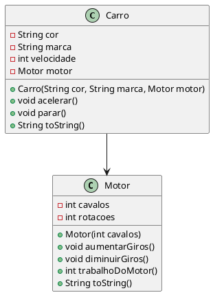
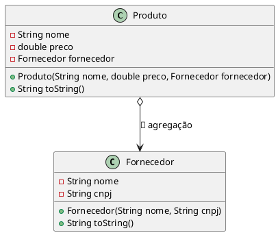
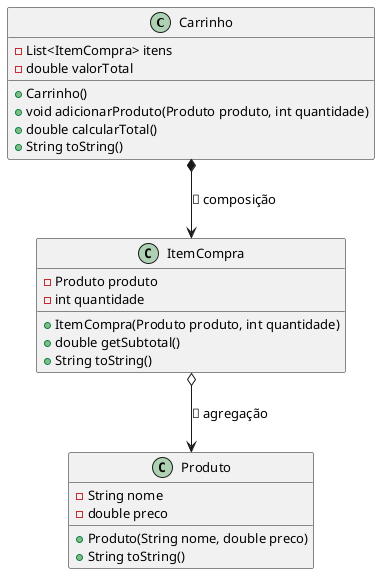
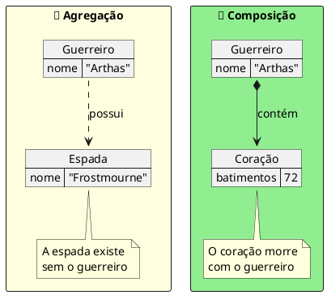

::: tip

**As criaturas já nascem, vivem e se comunicam. Agora é hora de entender como elas se conectam — e o que acontece quando uma precisa da outra para existir.**

:::

## 📖 A Revelação

### O que é uma Associação?

Até agora, nossas criaturas existiam de forma relativamente independente. Cada uma tinha seus atributos (essência) e seus métodos (poderes). Mas no mundo real — e no universo digital — as coisas se **relacionam**. Um carro possui um motor. Um carrinho de compras contém itens. Um produto tem um fornecedor.

::: note Associação
Uma **associação** é a forma como uma classe se relaciona com outra classe. Na prática, isso significa que uma classe possui um **atributo cujo tipo é outra classe**. Quando isso ocorre, dizemos que uma classe está **associada** à outra.
:::

Existem três tipos principais de associação em POO:

| Tipo           | Símbolo UML | Dependência                   | Metáfora               |
| -------------- | ----------- | ----------------------------- | ---------------------- |
| **Associação** | `→`         | Relação genérica              | 🔗 Elo entre criaturas |
| **Agregação**  | `◇→`        | A parte **existe** sem o todo | 🎒 Itens de Inventário |
| **Composição** | `◆→`        | A parte **morre** com o todo  | 🫀 Órgãos Vitais       |

### Agregação: as partes existem sozinhas

Na **agregação**, o objeto contido **não depende** da existência do objeto principal. Ele é passado de fora — como um item que uma criatura carrega na mochila. Se a criatura desaparece, o item continua existindo.

- A classe contida **não é instanciada** dentro da classe principal
- É tipicamente **passada por parâmetro** (no construtor ou num setter)
- O todo **usa** a parte, mas não a **cria**

**Exemplo concreto:** Um `Produto` tem um `Fornecedor`. Se o produto deixar de existir, o fornecedor continua vivo — ele fornece para outros produtos também.

### Composição: sem o todo, a parte morre

Na **composição**, o objeto contido **depende** da existência do principal. Ele é criado **dentro** do objeto principal — como um órgão dentro de um corpo. Se o corpo morre, o órgão morre junto.

- A classe contida **é instanciada** pela classe principal
- Quando o principal é removido da memória, os componentes **também são**
- O todo **contém** as partes (não apenas referências independentes)

**Exemplo concreto:** Um `Carrinho` de compras contém `ItemCompra`. Se o carrinho for destruído, os itens de compra perdem o sentido — eles existem **apenas** dentro daquele carrinho.

### Como identificar: a pergunta decisiva

Para decidir entre agregação e composição, faça esta pergunta:

> _Se o todo for destruído, a parte ainda faz sentido sozinha?_

- **Sim** → Agregação (🎒 item de inventário)
- **Não** → Composição (🧩 órgão vital)

## 🌌 A Gênese

### Órgãos Vitais e Itens de Inventário

O Deus Criador evoluiu. Suas criaturas já nascem com identidade, se comunicam e se comparam. Mas o universo ficou mais complexo: as criaturas agora são formadas por **partes**. Algumas partes são essenciais — sem elas, a criatura não sobrevive. Outras são acessórios que a criatura carrega, mas que existem independentemente dela.

> _"Um guerreiro sem coração é apenas pedra. Mas um guerreiro sem espada ainda é um guerreiro — desarmado, mas vivo."_

O coração é um **Órgão Vital** (composição). A espada é um **Item de Inventário** (agregação). Se o guerreiro morre, o coração morre junto — mas a espada pode ser recolhida por outra criatura.

O Deus percebeu que essa lógica se aplica a todo o universo:

- Um **Carro** possui um **Motor** — o motor é passado de fora, poderia estar em outro carro. Isso é **agregação**.
- Um **Carrinho** de compras cria seus próprios **Itens**. Se o carrinho é abandonado, os itens desaparecem. Isso é **composição**.
- Um **Pedido** de compra contém **Itens do Pedido** — sem o pedido, os itens perdem o sentido.

> _"A composição é o elo mais forte entre criaturas. É como a relação entre um corpo e seus órgãos: inseparáveis, interdependentes, essenciais."_

O Criador entendeu: as relações entre criaturas definem a **arquitetura** do universo. Um universo sem relações é apenas um conjunto de seres isolados — sem vida, sem propósito, sem história.

## 💻 O Código Sagrado

### Associação simples: Carro e Motor

Vamos começar com o exemplo mais clássico: um carro que possui um motor.

::: figure Diagrama UML: associação entre Carro e Motor.



:::

```java
public class Motor {
    int cavalos;
    int rotacoes;

    Motor(int cavalos) {
        this.cavalos = cavalos;
        this.rotacoes = 0;
    }

    void aumentarGiros() {
        this.rotacoes += 500;
    }

    void diminuirGiros() {
        if (this.rotacoes >= 500) {
            this.rotacoes -= 500;
        }
    }

    int trabalhoDoMotor() {
        return this.cavalos * this.rotacoes;
    }

    @Override
    public String toString() {
        return "Motor " + this.cavalos + "cv | Rotações: " + this.rotacoes;
    }
}
```

```java
public class Carro {
    String cor;
    String marca;
    int velocidade;
    Motor motor; // 🔗 Associação: Carro TEM UM Motor

    // O motor é recebido de fora — ele já existe antes do carro
    Carro(String cor, String marca, Motor motor) {
        this.cor = cor;
        this.marca = marca;
        this.motor = motor;
        this.velocidade = 0;
    }

    void acelerar() {
        this.motor.aumentarGiros();
        this.velocidade += this.motor.trabalhoDoMotor() / 1000;
    }

    void parar() {
        this.velocidade = 0;
        this.motor.diminuirGiros();
    }

    @Override
    public String toString() {
        return this.marca + " " + this.cor + " | Vel: " + this.velocidade
                + " | " + this.motor;
    }
}
```

```java
public class Universo {
    public static void main(String[] args) {
        // O motor existe ANTES do carro — é criado de fora
        Motor motorV8 = new Motor(400);

        // O carro recebe o motor por parâmetro
        Carro fusca = new Carro("Azul", "VW", motorV8);

        IO.println(fusca); // VW Azul | Vel: 0 | Motor 400cv | Rotações: 0

        fusca.acelerar();
        IO.println(fusca); // VW Azul | Vel: 200 | Motor 400cv | Rotações: 500

        fusca.acelerar();
        IO.println(fusca); // VW Azul | Vel: 600 | Motor 400cv | Rotações: 1000
    }
}
```

Observe: o `Motor` foi criado **fora** do `Carro` e passado como parâmetro no construtor. O motor existe independentemente do carro. Se o carro fosse destruído, o motor continuaria existindo no universo.

### Agregação: Produto e Fornecedor

Na agregação, a relação é mais explícita: a parte existe antes e depois do todo.

::: figure Diagrama UML: agregação entre Produto e Fornecedor.



:::

```java
public class Fornecedor {
    String nome;
    String cnpj;

    Fornecedor(String nome, String cnpj) {
        this.nome = nome;
        this.cnpj = cnpj;
    }

    @Override
    public String toString() {
        return this.nome + " (CNPJ: " + this.cnpj + ")";
    }
}
```

```java
public class Produto {
    String nome;
    double preco;
    Fornecedor fornecedor; // 🎒 Agregação: o fornecedor existe independentemente

    Produto(String nome, double preco, Fornecedor fornecedor) {
        this.nome = nome;
        this.preco = preco;
        this.fornecedor = fornecedor;
    }

    @Override
    public String toString() {
        return this.nome + " - R$" + this.preco
                + " | Fornecedor: " + this.fornecedor;
    }
}
```

```java
public class Universo {
    public static void main(String[] args) {
        // O fornecedor existe ANTES de qualquer produto
        Fornecedor samsung = new Fornecedor("Samsung", "12.345.678/0001-99");

        // Vários produtos compartilham o MESMO fornecedor
        Produto tv = new Produto("Smart TV 55\"", 2500.0, samsung);
        Produto celular = new Produto("Galaxy S24", 4200.0, samsung);

        IO.println(tv);
        IO.println(celular);

        // Se o produto "tv" fosse destruído, samsung continua vivo!
    }
}
```

::: tip
Na agregação, a parte é **passada por parâmetro**. O todo não a cria — apenas a **referencia**. Se o todo for destruído, a parte continua existindo no universo.
:::

### Composição: Carrinho e ItemCompra

Na composição, a parte só existe dentro do todo. Ela é **criada** pelo todo.

::: figure Diagrama UML: composição entre Carrinho e ItemCompra, agregação entre ItemCompra e Produto.



:::

```java
public class Produto {
    String nome;
    double preco;

    Produto(String nome, double preco) {
        this.nome = nome;
        this.preco = preco;
    }

    @Override
    public String toString() {
        return this.nome + " - R$" + this.preco;
    }
}
```

```java
public class ItemCompra {
    Produto produto; // 🎒 Agregação: o produto existe fora do item
    int quantidade;

    ItemCompra(Produto produto, int quantidade) {
        this.produto = produto;
        this.quantidade = quantidade;
    }

    double getSubtotal() {
        return this.produto.preco * this.quantidade;
    }

    @Override
    public String toString() {
        return this.quantidade + "x " + this.produto.nome
                + " = R$" + this.getSubtotal();
    }
}
```

```java
import java.util.ArrayList;
import java.util.List;

public class Carrinho {
    List<ItemCompra> itens; // 🧩 Composição: os itens são CRIADOS aqui

    Carrinho() {
        this.itens = new ArrayList<>(); // O carrinho cria sua própria lista
    }

    // O carrinho CRIA o ItemCompra internamente — composição!
    void adicionarProduto(Produto produto, int quantidade) {
        ItemCompra item = new ItemCompra(produto, quantidade);
        this.itens.add(item);
    }

    double calcularTotal() {
        double total = 0;
        for (ItemCompra item : this.itens) {
            total += item.getSubtotal();
        }
        return total;
    }

    @Override
    public String toString() {
        String resultado = "🛒 Carrinho de Compras:\n";
        for (ItemCompra item : this.itens) {
            resultado += "  - " + item + "\n";
        }
        resultado += "  Total: R$" + this.calcularTotal();
        return resultado;
    }
}
```

```java
public class Universo {
    public static void main(String[] args) {
        // Produtos existem independentemente (serão agregados)
        Produto arroz = new Produto("Arroz 5kg", 25.90);
        Produto feijao = new Produto("Feijão 1kg", 8.50);
        Produto leite = new Produto("Leite 1L", 6.30);

        // O carrinho CRIA os itens internamente (composição)
        Carrinho carrinho = new Carrinho();
        carrinho.adicionarProduto(arroz, 2);
        carrinho.adicionarProduto(feijao, 3);
        carrinho.adicionarProduto(leite, 6);

        IO.println(carrinho);
        // 🛒 Carrinho de Compras:
        //   - 2x Arroz 5kg = R$51.8
        //   - 3x Feijão 1kg = R$25.5
        //   - 6x Leite 1L = R$37.8
        //   Total: R$115.1

        // Se o carrinho for destruído, os ItemCompra morrem junto (composição)
        // Mas os produtos (Arroz, Feijão, Leite) continuam existindo (agregação)
    }
}
```

::: warning Composição vs Agregação — a diferença no código

- **Composição:** o `Carrinho` **cria** o `ItemCompra` dentro de `adicionarProduto()` — o item nasce dentro do carrinho e morre com ele.
- **Agregação:** o `ItemCompra` **recebe** o `Produto` por parâmetro — o produto existe antes e depois do item.
  :::

### Resumo visual: Agregação vs Composição

::: figure Comparação visual entre Agregação e Composição.



:::

| Critério                | 🎒 Agregação            | 🧩 Composição            |
| ----------------------- | ----------------------- | ------------------------ |
| A parte existe sozinha? | **Sim**                 | **Não**                  |
| Quem cria a parte?      | **Classe externa**      | **O próprio todo**       |
| Passagem                | **Parâmetro** (externo) | **Instanciação interna** |
| Se o todo morre...      | A parte **sobrevive**   | A parte **morre junto**  |
| UML                     | Losango vazio (`◇`)     | Losango preenchido (`◆`) |
| Metáfora                | Item no inventário      | Órgão no corpo           |

<!-- 
## 🔨 O Desafio do Criador

- [Desafio 04 - Associações, Agregação e Composição](../desafios/04_associacoes.md)

## Referências
 -->
