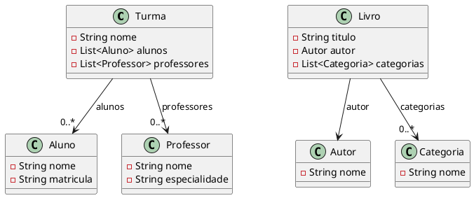

::: tip

**Você já conhece associações. Agora vamos aprender como construir uma lista e usá-la para conectar várias criaturas.**

:::

## 📖 O que são associações com listas?

Quando uma classe está associada a outra através de um `List`, dizemos que ela mantém uma relação de **um para muitos** ou **muitos para muitos**.

- Um `Carro` pode ter muitos `Passageiros`
- Uma `Turma` pode ter muitos `Alunos`
- Um `Livro` pode pertencer a muitas `Categorias`
- Uma `Escola` pode ter muitas `Turmas`

Em Java, isso se modela escrevendo um atributo com tipo de coleção:

```java
private List<Aluno> alunos;
private List<Livro> livros;
private List<Categoria> categorias;
```

Mas isso ainda não cria a lista em si. Para criar a lista, é preciso instanciar um objeto de `ArrayList`:

```java
private List<Aluno> alunos = new ArrayList<>();
private List<Livro> livros = new ArrayList<>();
private List<Categoria> categorias = new ArrayList<>();
```

- `List<Aluno>` declara o tipo da lista.
- `new ArrayList<>()` cria a lista em memória.
- `<>` usa inferência de tipo, então o Java sabe que é `ArrayList<Aluno>`.

Esta é a forma mais comum de tornar uma associação **dinâmica** e **flexível**.

<figure>



<figcaption>UML de associações com listas para Turma/Aluno/Professor e Livro/Categoria.</figcaption>
</figure>

## 🌌 Por que usar `ArrayList` nas associações?

`ArrayList` é uma coleção que permite:

- armazenar vários objetos relacionados
- adicionar e remover itens dinamicamente
- percorrer a lista com `for`, `foreach` ou `forEach`
- usar `contains` para verificar se um objeto já está presente

É perfeito para classes que representam entidades do tipo **todo** que contém ou referencia **muitas partes**.

## 🧠 Associações 1:N com listas

O exemplo do arquivo `08_ArrayList` mostra um domínio bancário:

- `Cliente` possui `List<Conta>`
- `Agencia` possui `List<Conta>`
- `Conta` possui `List<CartaoDeCredito>`

Essa é uma associação de **um para muitos**: um cliente pode ter várias contas, e uma agência pode controlar várias contas.

### Exemplo: Turma, Aluno e Professor

Baseado no exercício de modelagem de listas, vamos ver como uma escola pode usar listas para associar turmas, alunos e professores.

```java
import java.util.ArrayList;
import java.util.List;

public class Turma {
    private String nome;
    private List<Aluno> alunos = new ArrayList<>();
    private List<Professor> professores = new ArrayList<>();

    public Turma(String nome) {
        this.nome = nome;
    }

    public void adicionarAluno(Aluno aluno) {
        if (!alunos.contains(aluno)) {
            alunos.add(aluno);
        }
    }

    public void adicionarProfessor(Professor professor) {
        if (!professores.contains(professor)) {
            professores.add(professor);
        }
    }

    public List<Aluno> getAlunos() {
        return alunos;
    }

    public List<Professor> getProfessores() {
        return professores;
    }
}
```

```java
public class Aluno {
    private String nome;
    private String matricula;

    public Aluno(String matricula, String nome) {
        this.nome = nome;
        this.matricula = matricula;
    }

    @Override
    public String toString() {
        return nome + " (" + matricula + ")";
    }
}

public class Professor {
    private String nome;
    private String especialidade;

    public Professor(String nome, String especialidade) {
        this.nome = nome;
        this.especialidade = especialidade;
    }

    @Override
    public String toString() {
        return nome + " - " + especialidade;
    }
}

public class AulaPrincipal {
    public static void main(String[] args) {
        Turma turma = new Turma("POO - 2025");
        Aluno aluno = new Aluno("A001", "João");
        Professor professor = new Professor("Mariana", "Java");

        turma.adicionarAluno(aluno);
        turma.adicionarProfessor(professor);

        turma.getAlunos().forEach(System.out::println);
        turma.getProfessores().forEach(System.out::println);
    }
}
```

Neste exemplo:

- `Turma` tem uma associação com muitos `Aluno`
- `Turma` tem uma associação com muitos `Professor`

### Por que usar `contains`?

O método `contains` usa `equals` para comparar objetos na lista. Por isso, quando armazenamos objetos associados em uma lista, devemos implementar `equals` corretamente.

```java
@Override
public boolean equals(Object obj) {
    if (this == obj) return true;
    if (!(obj instanceof Aluno)) return false;
    Aluno outro = (Aluno) obj;
    return this.matricula.equals(outro.matricula);
}
```

Sem isso, duas instâncias diferentes com mesmo conteúdo podem ser consideradas diferentes.

## 📚 Exemplo: Biblioteca digital com categorias e autores

Outro domínio rico em listas é a biblioteca digital do exercício. Um livro pode ser classificado em várias categorias e pertence a um autor.

```java
public class Livro {
    private String titulo;
    private Autor autor;
    private List<Categoria> categorias = new ArrayList<>();

    public Livro(String titulo, Autor autor) {
        this.titulo = titulo;
        this.autor = autor;
    }

    public void adicionarCategoria(Categoria categoria) {
        if (!categorias.contains(categoria)) {
            categorias.add(categoria);
        }
    }

    public List<Categoria> getCategorias() {
        return categorias;
    }
}
```

Aqui temos:

- `Livro` associado a um único `Autor`
- `Livro` associado a muitas `Categoria` através de `List<Categoria>`
- `Categoria` e `Livro` formam um relacionamento de **muitos para muitos** quando cada categoria pode ter muitos livros e cada livro pode ter muitas categorias

## 🔧 Uma prática mais segura ao exibir listas

Uma lista é um detalhe de implementação. Quem usa sua classe não precisa saber se você usa `ArrayList`, `LinkedList` ou outro tipo.

Prefira expor `List<T>` nos métodos públicos:

```java
public List<Aluno> getAlunos() {
    return alunos;
}
```

Isso mantém o foco na associação entre as classes, sem prender quem usa a classe à forma como a lista foi implementada.

## 🧭 Como percorrer associações com listas

### Usando `for` tradicional

```java
for (int i = 0; i < turma.getAlunos().size(); i++) {
    System.out.println(turma.getAlunos().get(i));
}
```

### Usando `foreach`

```java
for (Aluno aluno : turma.getAlunos()) {
    System.out.println(aluno);
}
```

### Usando Java 8 `forEach`

```java
turma.getAlunos().forEach(aluno -> System.out.println(aluno));
```

## 🚀 Conectando listas e associações

As listas são o principal recurso para modelar relações reais em seus sistemas:

- `List<Conta>` representa várias contas de um cliente
- `List<Aluno>` representa os alunos de uma turma
- `List<Categoria>` representa as categorias de um livro
- `List<CartaoDeCredito>` representa os cartões ligados a uma conta

Uma associação com lista deixa o seu modelo mais fiel ao mundo real e mais preparado para mudanças.

## 🏗️ Exercícios práticos

- Modele um sistema de **Biblioteca Digital** com `Livro`, `Autor` e `Categoria`. Cada livro pode pertencer a várias categorias e cada autor pode ter vários livros.
- Modele um sistema de **Gerenciamento de Escola** com `Escola`, `Turma`, `Aluno` e `Professor`. Uma turma deve poder listar vários alunos e vários professores.
- Modele um sistema de **Loja de Roupas** com `Departamento`, `Produto`, `Cliente` e `Carrinho`. Um cliente pode ter vários carrinhos e cada carrinho pode conter vários produtos.
- Modele um sistema de **Reserva de Hotel** com `Hotel`, `Quarto`, `Reserva` e `Cliente`. Cada hotel tem vários quartos, e cada reserva pode afetar a disponibilidade de vários quartos.
- Modele um sistema de **Projeto de Software** com `Projeto`, `Tarefa` e `Funcionario`. Um projeto tem várias tarefas, e cada tarefa pode ser atribuída a vários funcionários.

## Resumo

- `List` serve para representar associações 1:N e N:N
- Use `ArrayList` internamente para armazenar os objetos
- Exponha `List<T>` nos métodos públicos
- Implemente `equals()` quando usar `contains()` em listas de objetos
- Use laços e `forEach` para percorrer as relações associadas

> **A chave é entender que a lista não é um atributo qualquer: ela é a associação viva entre duas classes.**
